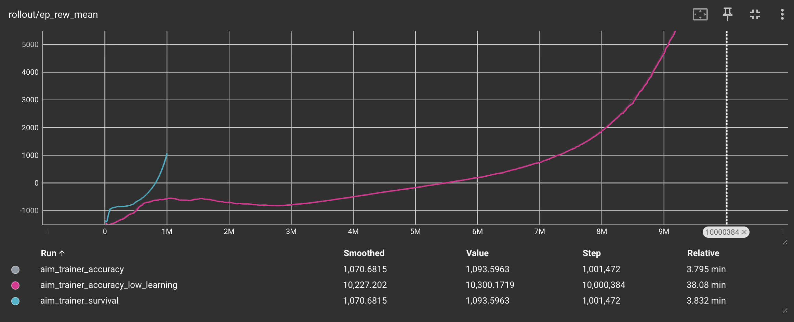
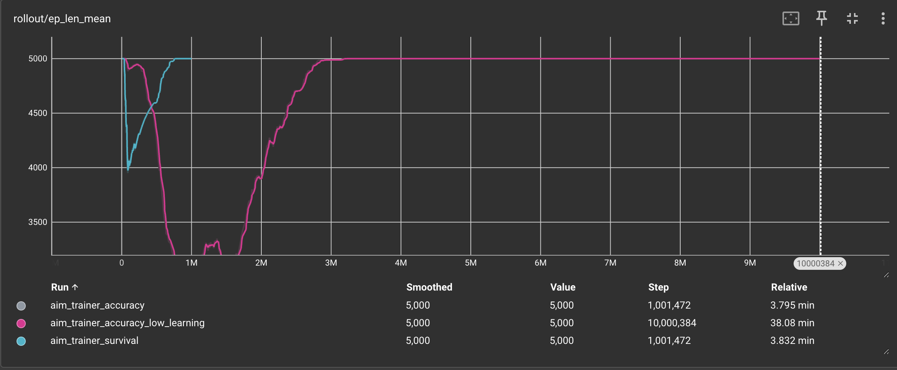

# Aim Training

## Abstract
For running the best model for training, evaluation and visualization, you can run these commands. I just put this here
so that you do not have to read the rest of it if you do not want. Reminder to be in the aim_trainer directory. The model was 
renamed "ppo_aim_trainer_accuracy_lower_learning_rate" by hand as the default is ppo_aim_trainer_accuracy

Lower Learning Rate Accuracy Training:  python src/train_aim_trainer.py --timesteps 10000000 --learning_rate 1e-5 --reward_mode accuracy

Lower Learning Rate Accuracy Evaluation: python src/eval_aim_trainer.py --reward_mode accuracy --model_path models/ppo_aim_trainer_accuracy_lower_learning_rate --max_steps 10000

Lower Learning Rate Accuracy Visualization: python src/visualize_aim_trainer.py --reward_mode accuracy --model_path models/ppo_aim_trainer_accuracy_lower_learning_rate --max_steps 10000

## Training
**From within the aim_trainer folder**

Command: python src/train_aim_trainer.py

Lower Learning Rate Accuracy Training:  python src/train_aim_trainer.py --timesteps 10000000 --learning_rate 1e-5 --reward_mode accuracy

Accuracy Training: python src/train_aim_trainer.py --timesteps 1000000 --reward_mode accuracy

Survival Training: python src/train_aim_trainer.py --timesteps 1000000 --reward_mode survival

This will automatically save the models and the tf logs to their respective folders, but their locations can be changed
as seen below

### Arguments

- timesteps: Default to 1,000,000 \
Total time steps to train for
- seed: 42 \
So you can test randomization
- logdir: ./tf_logs
Where the TF log files go after training
- modeldir: ./models
Where the model files go after training
- max_steps: 5000 \
The max steps per episode if the game were
to run too long. We never had this "issue"
- reward_mode: accuracy \
The reward mode, for this game its survival and 
accuracy though accuracy worked out better for both scores
- learning_rate: 1e-4 \
The learning rate for the PPO model, basically how fast it 
converges in gradient decent
- n_steps: 2048 \
Another variable for the PPO model, the number of steps it runs
before updating for each environment
- batch_size: 64\
The batch size for the PPO model
- n_epochs: 10\
The number of epochs run in the PPO model
- gamma: 0.99 \
The gamma for the PPO mode. I am pretty sure this makes sure that
 no single training example takes over the end decision for the model
- gae_lambda: 0.95 \
I think that this is similar to regular gamma, but it uses a 
"general advantage estimator". I took this value from other code that 
I had seen relating to this project such as your Flappy Bird model

## Evaluation
**From within the aim_trainer folder**

Command: python src/eval_aim_trainer.py

Lower Learning Rate Accuracy Evaluation: python src/eval_aim_trainer.py --reward_mode accuracy --model_path models/ppo_aim_trainer_accuracy_lower_learning_rate --max_steps 10000

Accuracy Evaluation: python src/eval_aim_trainer.py --reward_mode accuracy --model_path models/ppo_aim_trainer_accuracy

Survival Evaluation: python src/eval_aim_trainer.py --reward_mode survival --model_path models/ppo_aim_trainer_survival

The evaluations will run headless by default since there is also a visualization script, but if you would like to watch the 
evaluation as well, you can set the --render flag as seen below.

### Arguments
- model_path \
The path of the model that you would like to run
- episodes: 10 \
The number of episodes that you would like to evaluate
- reward_mode: accuracy \
The reward mode that you are testing. This should be the same as the model if you want good results (obviously).
- seed: None (meaning it will randomize the seed) \
So you can prove randomization
- render: 0 (meaning false) \
If you would like pygame to render the evaluation for you, the default is no so that you can get quick evaluations, and
visualize with the visualize script
- max_steps: 5000 \ 
The max steps before the simulation will cut off so it does not run forever

## Visualization
**From within the aim_trainer folder**

Command: python src/visualize_aim_trainer.py

Lower Learning Rate Accuracy Visualization: python src/visualize_aim_trainer.py --reward_mode accuracy --model_path models/ppo_aim_trainer_accuracy_lower_learning_rate --max_steps 10000

Accuracy Visualization: python src/visualize_aim_trainer.py --reward_mode accuracy --mode_path models/ppo_aim_trainer_accuracy

Survival Visualization: python src/visualize_aim_trainer.py --reward_mode survival --mode_path models/ppo_aim_trainer_survival

The actual script that is meant for visualization. It is much more lightweight than the evaluation script, and it automatically
will render the game for you.

### Arguments
- model_path \
The path of the model that you would like to run
- max_steps: 5000 \ 
The max steps before the simulation will cut off so it does not run forever, otherwise it will for the lower learning
rate model
- episodes: 10 \
The number of episodes that you would like to visualize
- fps: 60 \
The frames per second that you would like PyGame to run at
- reward_mode: accuracy \
The reward mode that you are visualizing. This should be the same as the model if you want good results (obviously).

## Environment
This section is just to give some information about the environment. The rewards "function" is not actually a function 
and is located in the step function. This is because it has a great deal of interaction with the actual steps, such as 
rendering new targets, so I decided to keep it there. 
The observation space for the game was as follows:
- mouse_x = The relative x position of the mouse in relation to the screen
- mouse_y = The relative y position of the mouse in relation to the screen
- target_x = The relative x position of the target centre in relation to the screen
- target_y = The relative y position of the target centre in relation to the screen
- ball_size = The ratio of the current ball size to the maximum size that it can get
- growth_speed = The speed at which the ball is growing, this is constant but could be linear or exponential in another 
version

The action space was the position of the mouse on the screen. I initially tried to add a clicking action space too, but
the model was taking advantage of my extremely complex rewards function (since I could not get it to work with a simple one)
so I took this feature out. I believe that this would have not been necessary anyway as the models just get perfect targets
every time and just would just every step. 

The rewards function for this game was quite complex because I was having to balance the cheating that the models 
were doing. The rewards that the models get are:
- A base hit reward of 2
- An accuracy bonus from 0-1 based on how close it was to the target centre
- A size bonus for how quickly it hit the target (before it grew)
- A survival bonus of 0.01, this is scaled by 5 for survival mode
- A proximity bonus based on how close the cursor is to the target, this is scaled for survival mode by 2.5

The penalties are as follows:
- Distance penalty of the ratio between the miss distance and the max miss distance by 0.5
- A base miss penalty of 0.2
- A death penalty of 3

These rewards were derived from spotting cheating, such as going to the corner after each target, and slowly moving 
towards the target to farm proximity, and circling around a target to farm those points as well.

The game was adapted (meaning the code was copied into my specific
functions) from this [repository](https://github.com/JacobsProjects/Python-Aim-Trainer) so all credit to the actual creator.
AI models (ChatGPT 4 and Claude Sonnet 4) were used in the creation of some of the code and reward function, but was not 
used in the writing of this documentation or any other part of the project.

## Results

### Lower Learning (and 10x time steps to compensate) Rate Accuracy Evaluation
Evaluation:

Episodes: 10

Mean Reward: 33479.42 ± 410.81

Mean Score: 8353.00 ± 98.91

Mean Accuracy: 83.5% ± 1.0%

Overall Accuracy: 83.5% (83530/100000)

Mean Episode Length: 10000.0 steps

Crash Rate: 0.0%

Total Targets Hit: 83530

Total Targets Missed: 16470

### Accuracy Evaluation
Evaluation:

Episodes: 10

Mean Reward: -292.90 ± 161.58

Mean Score: 320.70 ± 40.99

Mean Accuracy: 3.2% ± 0.4%

Overall Accuracy: 3.2% (3207/100000)

Mean Episode Length: 10000.0 steps

Crash Rate: 0.0%

Total Targets Hit: 3207

Total Targets Missed: 96793

### Survival Evaluation
Evaluation:

Episodes: 10

Mean Reward: 973.87 ± 229.40

Mean Score: 355.30 ± 57.36

Mean Accuracy: 3.6% ± 0.6%

Overall Accuracy: 3.6% (3553/100000)

Mean Episode Length: 10000.0 steps

Crash Rate: 0.0%

Total Targets Hit: 3553

Total Targets Missed: 96447

## Charts and Graphs
**Note: In the charts below, the accuracy and survival models are overlapping due to the scale** 

The chart shown below shows the average rewards earned over time per episode by my three different models. It can be seen for all 
three models, that they were still in the state of rapidly learning, and if they were trained longer, would have yielded
better results. This is because all of them appear to been in exponential growth and have not yet flattened out yet. 

This chart shows the average length of the episodes in steps for each of the models over their training time. Due to the 
lowered learning rate on the model shown in pink, it can be seen that the model started off much worse than the other two
with higher learning rates, but around 2 million timesteps, quickly retained its top position. Since all of these models
reached the max_steps that I set when training, if I were to train these again I would increase these max steps to see if 
I could make more use of this chart data and really push the models as far as they could go. 

