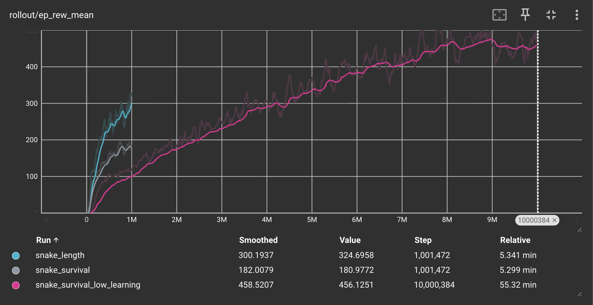
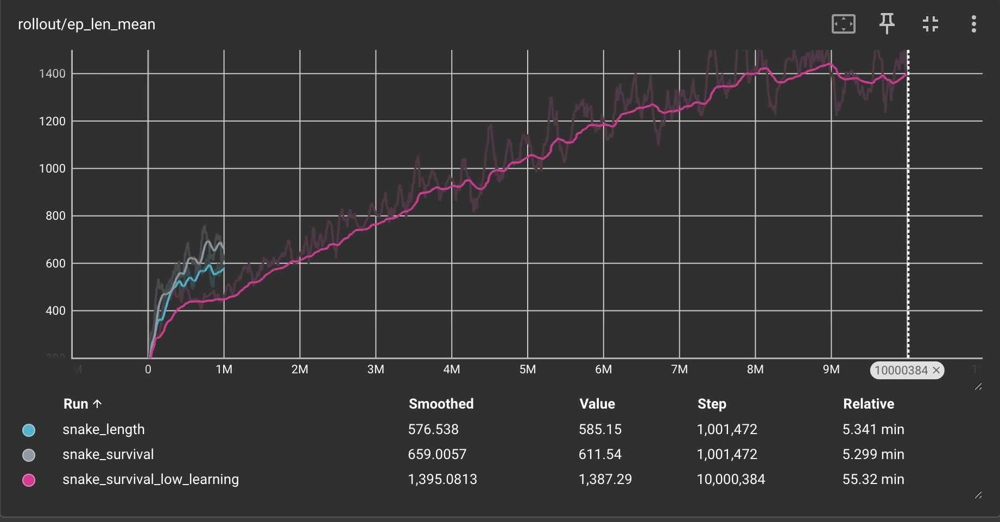

# Snake

## Abstract
For running the best model for training, evaluation and visualization, you can run these commands. I just put this here
so that you do not have to read the rest of it if you do not want. Reminder to be in the snake directory. The model was 
renamed "ppo_snake_survival_lower_learning_rate" by hand as the default is ppo_snake_survival

Lower Learning Rate Survival Training: python src/train_snake.py --timesteps 10000000 --reward_mode survival --learning_rate 2.5e-5

Lower Learning Rate Survival Evaluation: python src/snake_eval.py --reward_type survival --model_path models/ppo_snake_survival_lower_learning_rate

Lower Learning Rate Survival Visualisation: python src/visualize_snake.py --reward_mode survival --model_path models/ppo_snake_survival_lower_learning_rate

## Training
**From within the snake folder**

Command: python src/train_snake.py

Lower Learning Rate Survival Training: python src/train_snake.py --timesteps 10000000 --reward_mode survival --learning_rate 2.5e-5

Survival Training: python src/train_snake.py --timesteps 1000000 --reward_mode survival

Length Training: python src/train_snake.py --timesteps 1000000 --reward_mode length

This will automatically save the models and the tf logs to their respective folders, but their locations can be changed
as seen below

### Arguments

- timesteps: Default to 1,000,000 \
Total time steps to train for
- reward_mode: survival \
The reward mode, for this game its survival and 
accuracy though accuracy worked out better for both scores
- seed: 42 \
So you can test randomization
- logdir: ./tf_logs
Where the TF log files go after training
- modeldir: ./models
Where the model files go after training
- max_steps: 5000 \
The max steps per episode if the game were
to run too long. We never had this "issue"
- learning_rate: 2.5e-4 \
The learning rate for the PPO model, basically how fast it 
converges in gradient decent
- n_steps: 2048 \
Another variable for the PPO model, the number of steps it runs
before updating for each environment
- batch_size: 64\
The batch size for the PPO model
- n_epochs: 10\
The number of epochs run in the PPO model
- gamma: 0.99 \
The gamma for the PPO mode. I am pretty sure this makes sure that
 no single training example takes over the end decision for the model
- gae_lambda: 0.95 \
I think that this is similar to regular gamma, but it uses a 
"general advantage estimator". I took this value from other code that 
I had seen relating to this project such as your Flappy Bird model

## Evaluation
**From within the snake folder**

Command: python src/snake_eval.py

Lower Learning Rate Survival Evaluation: python src/snake_eval.py --reward_type survival --model_path models/ppo_snake_survival_lower_learning_rate

Survival Evaluation: python src/snake_eval.py --reward_mode survival --mode_path models/ppo_snake_survival

Length Evaluation: python src/snake_eval.py --reward_mode length --mode_path models/ppo_snake_length

The evaluations will run headless by default since there is also a visualization script, but if you would like to watch the 
evaluation as well, you can set the --render flag as seen below.

### Arguments
- model_path \
The path of the model that you would like to run
- episodes: 20 \
- render: 0 (meaning false) \
If you would like pygame to render the evaluation for you, the default is no so that you can get quick evaluations, and
visualize with the visualize script
The number of episodes that you would like to evaluate
- reward_mode: survival \
The reward mode that you are testing. This should be the same as the model if you want good results (obviously).
- seed: None (meaning it will randomize the seed) \
So you can prove randomization
- max_steps: 5000 \ 
The max steps before the simulation will cut off so it does not run forever. This turned out not to be necessary, but
still useful if someone were to improve the model

## Visualization
**From within the snake folder**

Command: python src/visualize_snake.py

Lower Learning Rate Survival Visualisation: python src/visualize_snake.py --reward_mode survival --model_path models/ppo_snake_survival_lower_learning_rate

Survival Visualization: python src/visualize_snake.py --reward_mode survival --mode_path models/ppo_snake_survival

Length Visualization: python src/visualize_snake.py --reward_mode length --mode_path models/ppo_snake_length

The actual script that is meant for visualization. It is much more lightweight than the evaluation script, and it automatically
will render the game for you.

### Arguments
- model_path \
The path of the model that you would like to run
- reward_mode: survival \
The reward mode that you are visualizing. This should be the same as the model if you want good results (obviously).
- max_steps: 5000 \ 
The max steps before the simulation will cut off so it does not run forever. This turned out not to be necessary, but
still useful if someone were to improve the model
- episodes: 5 \
The number of episodes that you would like to visualize
- fps: 60 \
The frames per second that you would like PyGame to run at

## Environment
This section is just to give some information about the environment. Unlike the aim trainer, this game does have a
dedicated rewards function since unlike the aim trainer, what happens in the rewards function does not have an effect 
on things outside the rewards function (that are not class variables). 
The observation space for this game was as follows:

- head_x = The relative position of the head of the snake to the screen in the x coordinate
- head_y = The relative position of the head of the snake to the screen in the x coordinate
- food_x = The relative position of the next food to the screen in the x coordinate
- food_y = The relative position of the next food to the screen in the y coordinate

- food_dist_x = The distance along the x axis to the next food
- food_dist_y = The distance along the x axis to the next food

- danger_up = If going up would kill the snake
- danger_down = If going down would kill the snake
- danger_left = If going left would kill the snake
- danger_right = If going right would kill the snake

- max_length = The max length the snake can get
- snake_length = The current length the snake is 

- dir_up = Is currently going up
- dir_down = Is currently going down
- dir_left = Is currently going left
- dir_right = Is currently going right

The action space was just the arrow keys, meaning up, down, left, and, right.

The rewards function for the survival mode gave the snake rewards every time that it at food, and also gave it rewards 
when the snake was moving closer to food. It's important to note that it is when it moves CLOSER not just the same distance
because than I had the issue where the snake would just circle the food. For the length mode, it also got a bonus each time 
it ate food, to the tune of its current length. This means that it got massive rewards for being larger.

The game was adapted (meaning the code was copied into my specific functions) from this [repository](https://github.com/rajatdiptabiswas/snake-pygame) so all 
credit to the actual creator. AI models (ChatGPT 4 and Claude Sonnet 4) were used in the creation of some of the code 
and reward function, but was not used in the writing of this documentation or any other part of the project.

## Results

### Lower Learning Rate Survival Evaluation

Evaluation:

Episodes: 20

Mean Reward: 664.69 ± 233.64

Mean Score: 48.20 (Best: 86)

Mean Snake Length: 51.2 (Best: 89)

Mean Episode Steps: 1944.5

Mean Food Eaten: 48.2

Mean Steps per Food: 40.3

Crash Rate: 100.0%

Timeout Rate: 0.0%

### Survival Evaluation

Evaluation:

Episodes: 20

Mean Reward: 319.25 ± 167.51

Mean Score: 23.55 (Best: 47)

Mean Snake Length: 26.6 (Best: 50)

Mean Episode Steps: 1026.9

Mean Food Eaten: 23.6

Mean Steps per Food: 43.6

Crash Rate: 100.0%

Timeout Rate: 0.0%

### Length Evaluation

Episodes: 20

Mean Reward: 314.03 ± 339.37

Mean Score: 11.25 (Best: 34)

Mean Snake Length: 14.2 (Best: 37)

Mean Episode Steps: 608.0

Mean Food Eaten: 11.2

Mean Steps per Food: 41.9

Crash Rate: 65.0%

Timeout Rate: 35.0%

## Charts and Graphs

The chart seen below shows the average amount of rewards that the model is receiving per episode by the number of timesteps
that it has been trained. This is the data that was used the most when determining which of the models is better since 
it shows the overall performance of the models using my quantitative measurement of the rewards function. The lower learning
rate model shows that the gain in rewards per timestep is starting to flatten out, meaning that allowing this particular 
model more timesteps to change without tweaking any hyperparameters or rewards function would most likely not change anything.

This chart shows the average amount of steps each episode was during training in relation to the number of timesteps it had
been trained for. Similar to the chart above, the lower learning rate model was starting to flatten out and the episodes 
on average were not getting longer as the training went on. However, the other two models with a higher learning rate 
appear to still be gaining steps exponentially, so if I were to do this again, I would train these two models for longer, 
and see if that would improve anything. 
